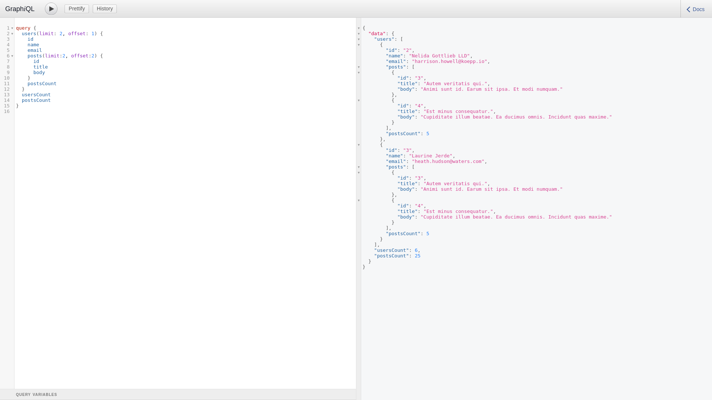

This repository is only used to create and test graphql count ignoring limit and offset.

* based on this guide: https://www.youtube.com/watch?v=kSlJH3hrV58

# Installation: 
```
bundle install
bundle exec rails db:create db:migrate db:seed
```
# How to use?

start: `rails s`

graphiql endpoint: `http://localhost:3000/graphiql`

# Example:


### Creation steps for rails app with graphql:
```
1) Creat Rails APP with models:
 1.1) rails new rails-api-with-graphql --api --skip-test
 1.2) rails g model User email:string name:string
 1.3) rails g model Post user:belongs_to title:string body:text
 1.4) db migrate
2) Add extra gems:
 2.1) add 'graphql', 'graphiql-rails' and 'faker' gems into the GEMFILE
 2.2) bundle update
3) create some fake data for testing:
 3.1) Insert this code into the db/seed.rb
 ########CODE-START##########
  5.times do
    user = User.create(name: Faker::Name.name, email: Faker::Internet.email)
    5.times do
      user.posts.create(title: Faker::Lorem.sentence(word_count:3), body: Faker::Lorem::paragraph(sentence_count:3))
    end
  end
 ########CODE-END###########
 3.2) rails db:seed
4) Generate files for GraphQL
 4.1)rails g graphql:install
 4.2)rails g graphql:object User
 4.3)rails g graphql:object Post
5) add graphiql into the config/routes.rb
 ########CODE-START##########
  if Rails.env.development?
    mount GraphiQL::Rails::Engine,
    at: "/graphiql",
    graphql_path: "graphql#execute"
  end
 ########CODE-END###########
 6) Get graphiql working
  6.1) uncomment require "sprockets/railtie" inside the application.rb file
  6.2) create app/assets/config/manifest.js file with this code:
    ########CODE-START##########
  	//= link graphiql/rails/application.css
	  //= link graphiql/rails/application.js
    ########CODE-END############
 7) modify the app/graphql/types/user_type.rb
	* add fields:
	   ########CODE-START##########
	     field :posts, [Types::PostType], null: true
    	     field :posts_count, Integer, null: true
	  ########CODE-END############
	* add count method: 
	   ########CODE-START##########
	      def posts_count
	        object.posts.size
	      end
	  ########CODE-END############
 8) modify app/graphql/query_type:
  ########CODE-START##########
    module Types
      class QueryType < Types::BaseObject
        # /users
        field :users, [Types::UserType], null: false

        def users
          User.all
        end

        # /user
        field :user, Types::UserType, null: false do
          argument :id, ID, required: true
        end

        def user(id:)
          User.find(id)
        end
      end
    end
  ########CODE-END############
```
